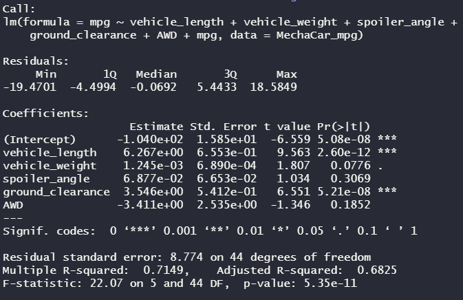
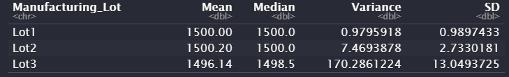
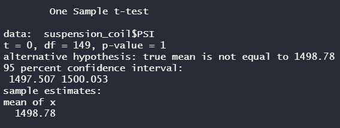
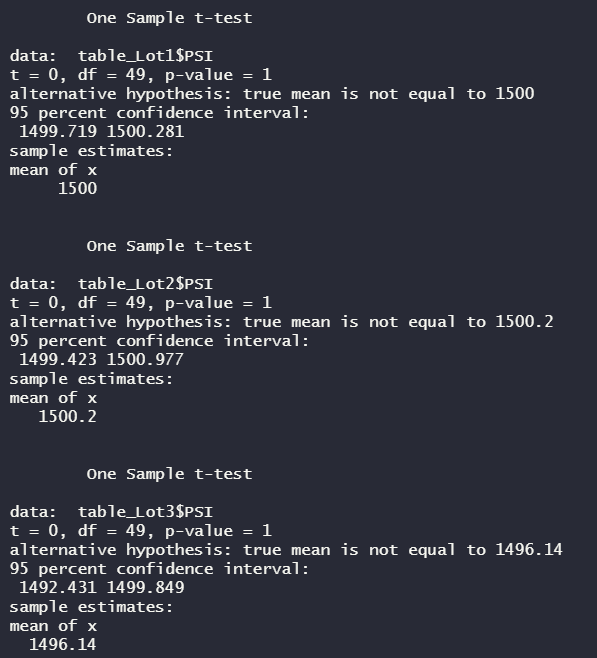

# R_Statistical_Analysis
Using Statistics and R for the Data Science

## Overview
AutosRUs’ newest prototype, the MechaCar, is suffering from production troubles that are blocking the manufacturing team’s progress. The purpose of this analysis is to offer insights on the MechaCar's production to help the manufacturing team utilizing R. Through the statistical analyses of the mile per gallons (MPG) of MechaCar prototypes and pounds per square inch (PSI) of the suspension coils, we will compare vehicle performance of the MechaCar vehicles against vehicles from other manufacturers.

## Objects
1. Perform multiple linear regression analysis to identify which variables in the dataset predict the mpg of MechaCar prototypes
2. Collect summary statistics on the pounds per square inch (PSI) of the suspension coils from the manufacturing lots
3. Run t-tests to determine if the manufacturing lots are statistically different from the mean population
4. Design a statistical study to compare vehicle performance of the MechaCar vehicles against vehicles from other manufacturers. For each statistical analysis, we’ll write a summary interpretation of the findings.

## Software/Tools
* Rstudio1.3.1, dplyr library, tidyverse library ggplot2 library, jsonlite library,  Github
* Two csv data are provided [MechaCar_mpg.csv](https://www.citibikenyc.com/system-data) webpage.

## Tasks

**Using Tableau we visualize in many aspect.**
* Load, clean up, and reshape datasets using tidyverse in R.
* Visualize datasets with basic plots such as line, bar, and scatter plots using ggplot2.
* Generate and interpret more complex plots such as boxplots and heatmaps using ggplot2.
* Plot and identify distribution characteristics of a given dataset.
* Formulate null and alternative hypothesis tests for a given data problem.
* Implement and evaluate simple linear regression and multiple linear regression models for a given dataset.
* Implement and evaluate the one-sample t-Tests, two-sample t-Tests, and analysis of variance (ANOVA) models for a given dataset.
* Implement and evaluate a chi-squared test for a given dataset.
* Identify key characteristics of A/B and A/A testing.
* Determine the most appropriate statistical test for a given hypothesis and dataset.

**The example of boxplots by fuel-efficiency type to make comparisons across manufacturers**

).png)

**Html link:**
https://htmlpreview.github.io/?https://github.com/sbaik97/R_Statistical_Analysis/blob/main/Practice/practice.html

## Challenges

### 1. Linear Regression to Predict MPG

The MechaCar_mpg.csv dataset contains mpg test results for 50 prototype MechaCars,produced using multiple design specifications to identify ideal vehicle performance. Herein, I designed a linear model that predicts the mpg of MechaCar prototypes using the multiple metrics, such as vehicle length, vehicle weight, spoiler angle, drivetrain,and ground clearance, using myknowledge of R.  

**Summary results from the linear regression**

 * Miles Per Gallon Linear Regression

 * Html link:

https://htmlpreview.github.io/?https://github.com/sbaik97/R_Statistical_Analysis/blob/main/MechaCar_Stat.Analysis/Predict_MPG.html

**Three questions**

1. Which variables/coefficients provided a non-random amount of variance to the mpg values in the dataset?

 * Repy:  Two variables, vehicle length and the ground_clearance, provide a non-random amount of variance. The contribution of each variable to the multiple linear regression model individual variable p-values are important. The p-value represents the probability
that each coefficient contributes a random amount of variance to the linear model. According to our results, vehicle length and the ground_clearance (as well as intercept) are statistically unlikely to provide random amounts of variance to the linear model. Both of these have extremely small p-value (less than 0.05 %), meaning that they had a high level of significance.  In other words the vehicle length and the ground_clearance have a significant impact on the MPG.
 
2. Is the slope of the linear model considered to be zero? Why or why not?

 * Repy: The slope of the multiple linear regression model is not considered to be zero. A multiple linear regression uses multiple independent variables to account for parts of the total variance observed in the dependent variable. And the linear regression shows that some of the independent variables had a significant effect on the dependent variable. If none of the independent variables had a dominent effect on the dependent variable then the linear regression would result in a near zero slope. 
 
3. Does this linear model predict mpg of MechaCar prototypes effectively? Why or why not?

 * Repy: The main indicator of whether the linear model predicts the mpg of the MechaCar is the r-squared value. According to the summary output, the r-squared value has increased from 0.37 in the simple linear regression model to 0.71 in the multiple linear regression model while the p-value remained significant. This means that the multiple linear regression model would be considered effective than the simple linear regression model.

## 2. Summary Statistics on Suspension Coils

The MechaCar Suspension_Coil dataset contains the pounds per square inch (PSI) results from multiple production lots by tesing the weight capacities of multiple suspension coils. Herein, I created two summary tables to look at the mean, median, variance, and standard deviation of data to determine if the manufacturing process is consistent across production lots. The first table looked at the all data across all manufacturing lots, while the second table looked the statistics at each of the three lots that the MechaCars were divided into. 

**Results from the Suspension Coils's statitstics**
 * Total Summary Table

 * Lot Summary Table

 * Html link:
https://htmlpreview.github.io/?https://github.com/sbaik97/R_Statistical_Analysis/blob/main/MechaCar_Stat.Analysis/Suspension_coil_stastics.html

**A question**
The design specifcations for the MechaCar suspension coils dictate that the variance of the suspension coils must not exceed 100
pounds per square inch. Does the current manufacturing data meet this design specifcation for all manufacturing lots in total and each
lot individually? Why or why not?

 * Repy: Looking at the total summary, the variance of total suspention coil is approximately 62.29 PSI, meaning that is does meet the design specification. When looking at the lots individuals, the lot number 1 and 2 meet the design specification at a varaince of approximately 0.97 PSI and 7.46 PSI respectfully, but the third lot does not with a high value of variance of 170.28. The third lot's variance is exceeding the design specification by 1.7 times of design specification. Therefore, the manufacturing team should work with the cars in lots 1 and 2, and check the lot 3 for improvement.
 

###  3. T-Tests on Suspension Coils

In this section, We will perform the t-tests to determine if all manufacturing lots and each lot individually are statistically different from the population mean of 1,500 pounds per square inch. We will use the t.test() function and to determine if
the PSI for each manufacturing lot is statistically different from the population mean of 1,500 pounds per square inch. 

**Results from the t-Tests on Suspension Coils**
 * t-test for All Three Combined Lot

 * t-test for Each Lot

 * Html link:
https://htmlpreview.github.io/?https://github.com/sbaik97/R_Statistical_Analysis/blob/main/MechaCar_Stat.Analysis/t-tests_suspension_coils.html

**Summary**
1. The t-test is the basic and popular statistical tests and the one-sample t-test is used to determine whether there is a statistical difference between the means of a sample dataset and a hypothesized, potential population dataset. Herein we performed the t-tests to determine if all manufacturing lots and each lot individually are statistically different from the population mean of 1,500 pounds PSI.

2. By using a significance level of 95%, meaning that 95% of the time this tests results would be true, I tested to see if any of the groups had a statistical difference from the mean of 1,500 PSI. After running the tests, all and each of three lots has the larger p- than 0.05. In the case the p-value is larger than the significance level, we would have sufficient evidence to reject the null hypothesis and state that the mean of all manufacturing lots and each lot individually are statistically different from the population mean of 1,500 PSI.

### 4. Study Design: MechaCar vs Competition

Design a new statistical study to compare performance of the MechaCar vehicles against performance of vehicles
from other manufacturers, using your knowledge of R.

1. What metric or metrics are you going to test?
 * Repy: The metrics I want to test are the fuel efficiencies of gasolin and hybrid cars.
 
2. What is the null hypothesis or alternative hypothesis?
 * Repy: Null Hypothesis is that all of the cars in the same class have the same fuel efficienies (Ho), which is generally the
hypothesis that can be explained by random chance. THe Alternative hypothesis is that they are not all the same (Ha), which is influencd by non-random events.
 
3. What statistical test would you use to test the hypothesis? And why?
 * Repy: I would use a t-test to complete the analysis for both types of car for the fuel efficiencies comparison. Also I would use the box plot in the ggplot2 library to show the potential spread of fuel effience.There are also different cartegory of car (types of car) within the two gasoline and hybrid cars. In this case we need to expend it to ANOVA test to compare the means of a continuous numerical variable across a number of groups.

4. What data is needed to run the statistical test?
 * Repy: I would need fuel efficiency data from 50 individual cars in the same class type to create a sample size of data for each car. The sample data distribution should be similar to its population data distribution and each sample size should reasonably large to get a significant level of statistics between two cartegories. 

